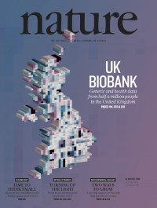

#### 10 October 2018

Today we published 2 papers in Nature.

The first describes our work on the centralized analysis of the genetic data on all 500,000 UK Biobank participants

[Bycroft et al. (2018) The UK Biobank resource with deep phenotyping and genomic data. Nature 562, pages 203–209.](https://www.nature.com/articles/s41586-018-0571-7)

The second describes genome wide association analysis of the brain imaging data collected on ~15,000 UK Biobank participants.

[Elliott et al. (2018) Genome-wide association studies of brain imaging phenotypes in UK Biobank. Nature 562, pages 210–216.](https://www.nature.com/articles/s41586-018-0571-7)

Here is some press that the papers received

[[Podcast]](https://soundcloud.com/jenny-mills-362181607/uk-biobank-genetics-opens-the-door-to-a-new-era-of-health-research) 
[[Wired article]](https://www.wired.co.uk/article/uk-biobank-genetic-studies-healthcare) 
[[Nature Editorial]](https://www.nature.com/articles/d41586-018-06950-9) 
[[Nature News and Views]](https://www.nature.com/articles/d41586-018-06948-3)
[[News Medical Article]](https://www.news-medical.net/news/20181011/UK-Biobank-provides-wealth-of-information-for-further-genetic-studies.aspx)

#### 29 June 2018
New version of our brain imaging GWAS is now on [bioRxiv](https://www.biorxiv.org/content/early/2018/06/29/178806) and includes a larger replication sample, fast multi-trait LMMs using our [SBAT software](https://www.dropbox.com/home/Oxford/software/software_webpages/sbat), co-heritability to brain related diseases and partitioned SNP heritability. …

#### 6 February 2018

[SBAT software](https://www.dropbox.com/home/Oxford/software/software_webpages/sbat) released created by Kevin Sharp. Super-fast multi-trait linear mixed models.

#### 17 October 2017

Released today : [Oxford Brain Imaging Genetics (BIG) server](http://big.stats.ox.ac.uk/) – a browser for 3,144 GWAS of brain imaging derived phenotypes in the UK Biobank, based on Elliott, L. et al (2017)

#### 21 August 2017

Our new Imaging Genetics paper worked on by Lloyd Elliott and Kevin Sharp is just out on bioRxiv

[Elliott et al. (2017) The genetic basis of human brain structure and function: 1,262 genome-wide associations found from 3,144 GWAS of multimodal brain imaging phenotypes from 9,707 UK Biobank participants.](http://www.biorxiv.org/content/early/2017/08/21/178806)

#### 21 July 2017

The UK Biobank Genetics paper is now on bioRxiv

[Bycroft et al. (2017) Genome-wide genetic data on ~500,000 UK Biobank participants.](http://www.biorxiv.org/content/early/2017/07/20/166298)

[IMPUTE 4](https://www.dropbox.com/sh/k6b34fzw9w4s8bg/AAA65aF5l2oj_AT9iDLgKCv9a?dl=0) and [SHAPEIT 3](https://jmarchini.org/software/#shapeit-3) released

#### 10 July 2017

New version of [BGENIE v1.1](https://jmarchini.org/#bgenie/) released. This version improves some of the computational aspects involving threading

#### 29 June 2017

Giving a talk today at the [UK Biobank Annual Meeting](http://www.ukbiobank.ac.uk/2017/06/annual-meeting-live-webcast-2/
)

#### 15 June 2016

Our new program BGENIE has been released for efficient GWAS for multiple continuous traits and PHEWAS

#### 10 December 2016

Giving a keynote talk today at the MLCB workshop at NIPS in Barcelona. My talk is on “Sparse Bayesian Modelling for Multitrait Genetic Association Studies” and will describe research carried out by Kevin Sharp (postdoc in my group) and Valentina Iotchkova (ex-DPhil student in my group).

#### 20 October 2016

Our group have the following presentations at ASHG in Vancouver this year

Platform Talk : J. Marchini Thu 20 Oct Session 34. Title : Phasing, imputation and analysis of 500,000 UK individuals genotyped for UK Biobank.

Poster : K.Sharp Thu 20 Oct. Title : A new sparse Bayesian method for multi-trait genome wide association studies

Poster : L. Elliott Fri 21 Oct. Title : Genome-wide association of 2,500 structural and functional brain imaging phenotypes in the UK Biobank study.

#### 1 October 2016

Welcome to Zhangyi (Jeffrey) He, Matt Kerin, Simone Rubinacci, Daniel Wells and Chris Gill, who have all started in the group.

#### 22 August 2016

The [Haplotype Reference Consortium](http://www.haplotype-reference-consortium.org/) paper is now out! Major contributions from Warren Kretzschmar who worked on this project

[The Haplotype Reference Consortium. A reference panel of 64,976 haplotypes for genotype imputation. Nature Genetics 10.1038/ng.3643](https://www.nature.com/articles/ng.3643)

#### 1 August 2016

New paper out from Victoria Hore in our group

[Victoria Hore, Ana Viñuela, Alfonso Buil, Julian Knight, Mark I McCarthy, Kerrin Small, Jonathan Marchini. Tensor decomposition for multi-tissue gene expression experiments. Nature Genetics 10.1038/ng.3624](https://www.nature.com/articles/ng.3624)

[SDA (Sparse Decomposition of Arrays) software](https://jmarchini.org/software/#sda)

#### 26 July 2016

We have two postdoc positions advertised right now. Get in touch if you want to know more

[http://tinyurl.com/zr8l96q](http://tinyurl.com/zr8l96q)      [http://tinyurl.com/h36aqrq](http://tinyurl.com/h36aqrq)

#### 30 June 2016

Presentation at The Broad Institute in Boston in their Molecular and Population Genetics seminar series, entitled “Modelling multiple phenotypes : better together”

#### 13 June 2016

Giving a talk today at the [UK Biobank Annual meeting](http://fsmevents.com/ukbiobank/annual-meeting/). 

#### 6 June 2016

New paper out now from our group in Nature Genetics entitled [Haplotype estimation for biobank-scale data sets](http://www.nature.com/ng/journal/vaop/ncurrent/full/ng.3583.html) on SHAPEIT3 which is being used to phase the UK Biobank project dataset

#### 31 May 2016

Recent interview I did about our [Wellcome Trust Collaborative Award](https://wellcome.ac.uk/what-we-do/case-studies/jonathan-marchini).

#### 5 May 2016

Congratulations to Warren Kretzschmar who passed his DPhil Viva today! His thesis title was “Methods for phasing and imputation of very low coverage sequencing data” and was examined by Simon Myers and Heather Cordell.

#### 15 April 2016

We have 3 new postdoc positions available to work on methods development for the 100,000 Genomes Project. These posts are funded by a Wellcome Trust Collaborative Award, and will be supervised jointly by Prof Jonathan Marchini, Prof Simon Myers and Dr Garrett Hellenthal (UCL). There are 2 positions in Statistical Genetics Methods Development and 1 post in Statistical Genetics Software Development.

#### 10 April 2016
Wellcome to Simone Rubinacci (SysBio DTC) and Daniel Wells (GMS) who have joined the group to do rotation projects.

#### 7 April 2016
Presentation at  International Congress of Human Genetics, Kyoto, Japan

Tensor decomposition uncovers trans eQTL networks in the multi-tissue EuroBATS study.

#### 6 April 2016
Revised version of the HRC paper now on [bioRxiv](https://www.biorxiv.org/content/10.1101/035170v2), now with replicated low MAF associations found using HRC imputation

#### 7 March 2016
Congratulations to Victoria Hore who passed her DPhil Viva today! Her thesis title was “Latent variable models for analysing multidimensional genetic data sets” and was examined by Simon Myers and Oliver Stegle.

#### 28 February 2016
Our new paper on phasing for high-coverage sequenced samples using large reference panels has just been published in [Bioinformatics](http://bioinformatics.oxfordjournals.org/content/early/2016/02/27/bioinformatics.btw065.abstract)

#### 23 February 2016
We are pleased to announce that the [2nd Probabilistic Modelling in Genomics conference (ProbGen16)](http://www.stats.ox.ac.uk/events/probgen16) will be held at the Department of Statistics in Oxford from 12-14 September 2016. Accommodation will be at Somerville College. We hope this will be an exciting meeting, showcasing much cutting-edge work in the area of Statistical Genomics. 

#### 23 February 2016
We have been awarded a Wellcome Trust Collaborative grant to work on the 100,000 Genomes Project. This work will be jointly supervised with Prof Simon Myers (Oxford) and Dr Garrett Hellenthal (UCL). More details to follow in due course.

#### 22 February 2016
Andrew Dahl‘s paper on Bayesian multiple phenotype prediction in genetic studies of related samples is now online at [Nature Genetics](http://www.nature.com/ng/journal/vaop/ncurrent/full/ng.3513.html)

The method is implemented in an [R package called PHENIX](https://mathgen.stats.ox.ac.uk/genetics_software/phenix/phenix.html)

#### 19 January 2016
Congratulations to Warren Kretzschmar who has just submitted his DPhil thesis!!!

#### 10 January 2016
Matt Kerin and Richard Brown have joined the group for their GMS rotation projects.

#### 24 December 2015
Haplotype Reference Consortium paper now available on [bioRxiv](http://biorxiv.org/content/early/2015/12/23/035170)

#### 23 December 2015
[Oxford Statistics Phasing Server](https://phasingserver.stats.ox.ac.uk/) is now live here (still in alphas testing mode)

The server was developed by Winni Kretzschmar and implements a new phasing approach mainly developed by Kevin Sharp

#### 22 December 2015
Congratulations to Victoria Hore who has just submitted her DPhil thesis!!!

#### 26 November 2015
Presentation at BIOSTATNET workshop on Biomedical (Big) Data at CRM, Barcelona

Tensor decomposition uncovers trans eQTL networks in the multi-tissue EuroBATS study.

#### 13 November 2015
We have successfully completed the phasing and imputation of the first ~150,000 samples of the UK Biobank Project. This will be a tremendous resource for the human genetics community over the next decade. We have written a [document](http://biobank.ctsu.ox.ac.uk/crystal/refer.cgi?id=157020) which details the statistical analysis involved.

#### 17 October 2015
Presentation at Probabilistic Modelling in Genomics 2015 (ProbGen15), CSHL

Modeling high-dimensional phenotypes in genetics—Uncovering brain networks and gene networks

#### 9 October 2015
ASHG Platform presentation

Tensor decomposition uncovers trans eQTL networks in the multi-tissue EuroBATS study.
Program Number: 224   Presentation Time: Friday 09 Oct 03:30PM-03:45PM

#### 1 October 2015
1000 Genomes Phase 3 paper published in Nature today!

Our group played a central role in the analysis for this project. We designed and implemented the genotype calling and phasing pipeline, which used SHAPEIT2 and MVNcall. Olivier Delaneau, Androniki Menelaou and Warren Kretzschmar all contributed to this work.

[Paper](http://www.nature.com/nature/journal/v526/n7571/full/nature15393.html)  
[Nature collection](http://www.nature.com/collections/dcfqmlgsrw)  
[Editorial](http://www.nature.com/news/variety-of-life-1.18454)  
[News and views](http://www.nature.com/nature/journal/v526/n7571/full/526052a.html)  
[Podcast](http://www.nature.com/nature/podcast/index-2015-10-01.html)  

#### 19 Sept 2015
The UK10K Project imputation reference panel paper has now been published in [Nature Communications](http://www.nature.com/ncomms/2015/150914/ncomms9111/full/ncomms9111.html)

#### 5 Sept 2015
Presentation at Genomics of Common Diseases Conference 2015

Title : Tensor decomposition uncovers trans eQTL networks in the multitissue EuroBATS study

#### 15 July 2015
The CONVERGE paper is now out in Nature. This study used low-coverage sequencing of 12,000 Chinese women to uncover new risk genes for Major Depression

[Paper](http://www.nature.com/nature/journal/v523/n7562/full/nature14659.html) [News article](http://www.nature.com/news/first-robust-genetic-links-to-depression-emerge-1.17979)

#### 1 July 2015
The first release of the [Haplotype Reference Consortium](http://www.haplotype-reference-consortium.org/) dataset can now be accessed via imputation servers.

#### 29 May 2015
Victoria Hore won the prize for the best student talk at the Quantitative Genomics 2015 conference. Her talk was entitled ‘Sparse Bayesian latent factor decompositions for identifying trans-eQTLs.

#### October 2014
We have done very well this year at the American Society of Human Genetics meeting in San Diego, with 3 members of the group being selected to give a talk about their research. Here are the details

Jonathan Marchini  Genetic network inference in studies of multiple phenotypes from related individuals.
Program Number: 24   Presentation Time: 02:15PM-02:30PM

Victoria Hore Sparse Bayesian latent factor decompositions for identifying trans-eQTLs.
Program Number: 262   Presentation Time: 12:15PM-12:30PM

Winni Kretzschmar A genotype likelihood based phasing and imputation method for massive sample sizes of low-coverage sequencing data.
Program Number: 150   Presentation Time: 10:30AM-10:45AM

Andy Dahl Mutiple-trait genomic selection and phenotype prediction.
Program Number: 1632S  Presentation Time: Sun, Oct 19, 2014, 5:00PM-6:00PM

#### 1 August 2014
The University of Oxford has made Jonathan Marchini a Professor of Statistical Genomics.

#### 16 June 2014
Our paper on calling genotypes and phasing has been published in [Nature Communications](http://www.nature.com/ncomms/2014/140606/ncomms4934/full/ncomms4934.html)

We have released a new version of [SHAPEIT2](https://mathgen.stats.ox.ac.uk/genetics_software/shapeit/shapeit.html) that implements this functionality.

We have also released a new version of IMPUTE2 that fixes a bug in the panel merging functionality, and provided a minor update our phased version of the 1000 Genomes Phase 1 dataset.

#### 17 Apr 2014
Jared O’Connell’s paper on a general method for phasing related samples has been published in [PLoS Genetics](https://journals.plos.org/plosgenetics/article?id=10.1371/journal.pgen.1004234)

The method is implemented within [SHAPEIT2](https://mathgen.stats.ox.ac.uk/genetics_software/shapeit/shapeit.html) and also in a standalone package called duoHMM.

#### 24 Mar 2014
We have just released a new version of [SHAPEIT2](https://mathgen.stats.ox.ac.uk/genetics_software/shapeit/shapeit.html) (v2 r767) that implements functionality for (a) using phase information in sequencing reads to help phasing, and (b)phasing in general pedigrees. This work is associated with the following two publications

[O. Delaneau, B. Howie, A. Cox, J-F. Zagury, J. Marchini (2013) Haplotype estimation using sequence reads. American Journal of Human Genetics 93 (4) 787-696](http://www.cell.com/AJHG/abstract/S0002-9297%2813%2900415-1?utm_source=ECE001&utm_campaign=&utm_content=&utm_medium=email&bid=OTV0E5F:3IUI5)

[J. O’Connell, D. Gurdasani, O. Delaneau, et al. (2014) A general approach for haplotype phasing across the full spectrum of relatedness. PLoS Genetics](https://journals.plos.org/plosgenetics/article?id=10.1371/journal.pgen.1004234)
 
 #### 18 Oct 2013
 We have done very well this year at the American Society of Human Genetics meeting in Boston, with 4 members of the group being selected to give a talk about their research. Here are the details

Jared O’Connell Haplotype phasing across the full spectrum of relatedness.
Platform presentation #192 Presentation Time: 03:15PM-03:30PM Session Location: Grand Ballroom West, Level 3, Convention Center

Marie Forest Simultaneous estimation of population size changes and splits times from population level resequencing studies
Platform presentation #268 Presentation Time: 08:00AM-08:15AM Session Location: Grand Ballroom West, Level 3, Convention Center

Jonathan Marchini A haplotype map derived from whole genome low-coverage sequencing of over 25,000 individuals.
Platform presentation #349 Presentation Time: 02:00PM-02:15PM Session Location: Grand Ballroom West, Level 3, Convention Center

Olivier Delaneau A new method for genotype calling and phasing for the 1000 Genomes Project leads to improved downstream imputation accuracy.
Platform presentation #352 Presentation Time: 02:45PM-03:00PM Session Location: Grand Ballroom West, Level 3, Convention Center

Valentina Iotchkova Bayesian sparse models of high-dimensional correlated traits in related and unrelated individuals.
Poster # 1777F Presentation Time: Fri, Oct 25, 2013, 10:30AM-11:30AM

Warren Kretzschmar  Phasing and imputation of 12,000 1x coverage whole genome sequenced Chinese women.
Poster # 1895W Presentation Time: Wed, Oct 23, 2013, 10:30AM-11:30AM

#### 3 Oct 2013
Our paper on using phase information in sequencing reads for haplotype estimation has been published by the American Journal of Human Genetics

[O. Delaneau, B. Howie, A. J. Cox, J-F. Zagury, J. Marchini (2013) Haplotype estimation using sequencing reads. AJHG 93 (4) 687-696.](http://www.cell.com/AJHG/abstract/S0002-9297%2813%2900415-1?utm_source=ECE001&utm_campaign=&utm_content=&utm_medium=email&bid=OTV0E5F:3IUI5)

#### 18 Sep 2013
We have just released a new version of the Phase 1 haplotypes from the 1000 Genomes Project. Using a set of validation genotypes at SNP and biallelic indels we have been able to show that these haplotypes have lower genotype discordance and improved imputation performance into downstream GWAS samples, especially at low frequency. The haplotypes are available from the 1000GP website or the IMPUTE2 website.

#### 21 Mar 2013
Our paper describing the genetic variation of short insertions and deletions using sequencing data from the 1000 Genomes Project has been published by [Genome Research](http://genome.cshlp.org/content/early/2013/03/11/gr.148718.112)

#### 29 Dec 2012
Our paper describing the SHAPEIT (v2) method has been published in [Nature Methods](http://www.nature.com/nmeth/journal/v10/n1/full/nmeth.2307.html)

This paper presents a significantly new algorithm for haplotype estimation that combines together the best ideas from IMPUTE2 and SHAPEIT1. The new method clearly outperforms other existing methods in terms of phasing performance and is very competitive computationally.

#### 6 Dec 2012
We have just released a new version of MULTIMIX (v1.1.0). This new version allows for missing data.

#### 4 Dec 2012
We have just released a new versions of SHAPEIT (v2). The paper on this new version has now been accepted in Nature Methods and will appear soon.

#### 10 Nov 2012
Olivier Delaneau has won a Charles Epstein Post-Doctoral Award (worth $2,000) at the ASHG conference in San Francisco for his work on SHAPEIT2. Well done Olivier! Androniki Menelaou made the final of the Pre-Doctoral competition (worth $1,000) but did not win a prize.

#### 7 Nov 2012
Claire Churchhouse’s paper has been published in [Genetic Epidemiology](http://onlinelibrary.wiley.com/doi/10.1002/gepi.21692/abstract)

In this paper we develop a method for carrying out admixture deconvolution with more than two source ancestral populations. The method can handle both phased or unphased data from the source and/or sample populations. The method was used to analyze data from Phase 1 of the 1000 Genomes Project which was recently published in Nature. The MULTIMIX software implementing this approach will appear here soon.

#### 1 November 2012
Jonathan Marchini has been awarded a [Philip Leverhulme Prize](https://www.leverhulme.ac.uk/philip-leverhulme-prizes-2012)

#### 1 November 2012
The latest 1000 Genomes Project paper has been published in [Nature](http://www.nature.com/nature/journal/v491/n7422/full/nature11632.html) today.

This is a big international collaboration that has sort to sequence a large number of individuals from around the world with the aim of mapping the majority of the genetic variation with frequency above 1%. Members of our group that contributed to the analysis were Olivier Delaneau, Claire Churchhouse, Jason Liu and myself. The project has been reported in the mainstream press.

#### 1 November 2012
The company Affymetrix has launched a new genotyping chip that was designed using our software IMPUTE2. They have issued a [press release giving the details](http://phx.corporate-ir.net/phoenix.zhtml?c=116408&p=irol-newsArticle&ID=1752709)

#### 23 October 2012
Androniki Menelaou’s paper has been published in [Bioinformatics](http://bioinformatics.oxfordjournals.org/content/early/2012/10/23/bioinformatics.bts632.abstract?keytype=ref&ijkey=G5i2fOHGfx7kzfc)

In this paper we show that combining low-coverage sequence data with microarray genotyping on the same subjects can lead to high quality haplotype reference sets that produce a notable boost in downstream imputation accuracy. The MVNcall software implementing this approach will appear here soon.

#### 2 October 2012
Jared O’Connell won the poster prize at the recent Genomics of Common Diseases conference in Potomac, MD, USA.

#### 27 August 2012
We have done very well this year with accepted talks at the American Society of Human Genetics meeting. Olivier Delaneau and Androniki Menelaou have made the final of the post-doctoral and pre-doctoral Charles J. Epstein Trainee Awards

#### 24 August 2012
Claire Churchouse has succesfully passed her viva. Her thesis entitled ‘Bayesian Methods for Estimating Human Ancestry Using Whole Genome SNP Data’ was examined be Dr Lachlan Coin and Dr Simon Myers. Claire is now off to start a postdoc with David Althuler at the Broad Institute of Harvard and MIT. Good luck Claire!

#### 22 July 2012
Our new paper (with Bryan Howie as co-lead author) on pre-phasing based imputation has now appeared in [Nature Genetics](http://www.nature.com/ng/journal/v44/n8/full/ng.2354.html)

#### 20 July 2012
Jared O’Connell’s paper on a new method for calling genotypes from array and sequence data has now appeared in [Genetic Epidemiology](http://onlinelibrary.wiley.com/doi/10.1002/gepi.21657/abstract)

#### 29 June 2012
Androniki Menelaou has succesfully passed her viva. Her thesis entitled ‘LD-based SNP and genotype calling from next-generation sequencing reads” was examined be Dr Vincent Plagnol and Prof Gil McVean. Androniki is now off to start a postdoc with Paul de Bakker at UMC Utrecht. Good luck Androniki!

#### 30 April 2012
Victoria Hore has joined the group for her DTC project. Welcome Vicky!

#### 12 April 2012
Warren Kretzschmar has joined the group for his rotation project. Welcome Winni!

#### 15 March 2012
Olivier Delaneau’s paper on the SHAPEIT method has now appeared in [Nature Methods](http://www.nature.com/nmeth/journal/v9/n2/abs/nmeth.1785.html)
