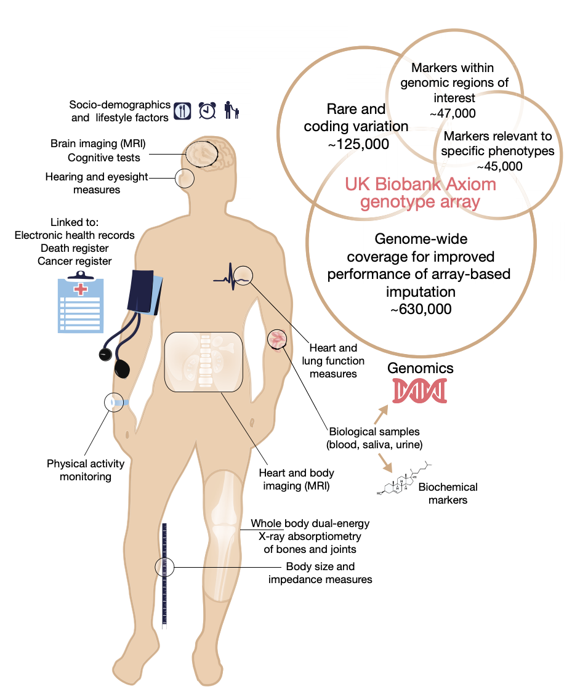
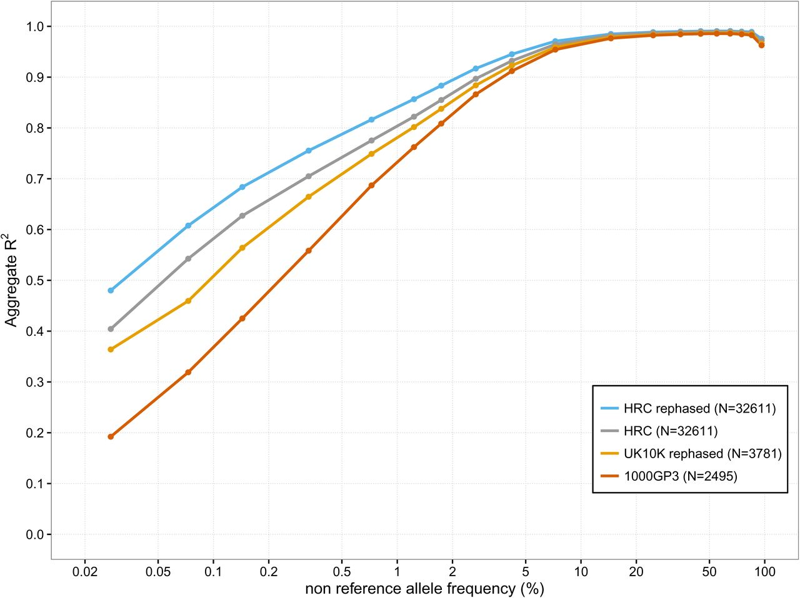
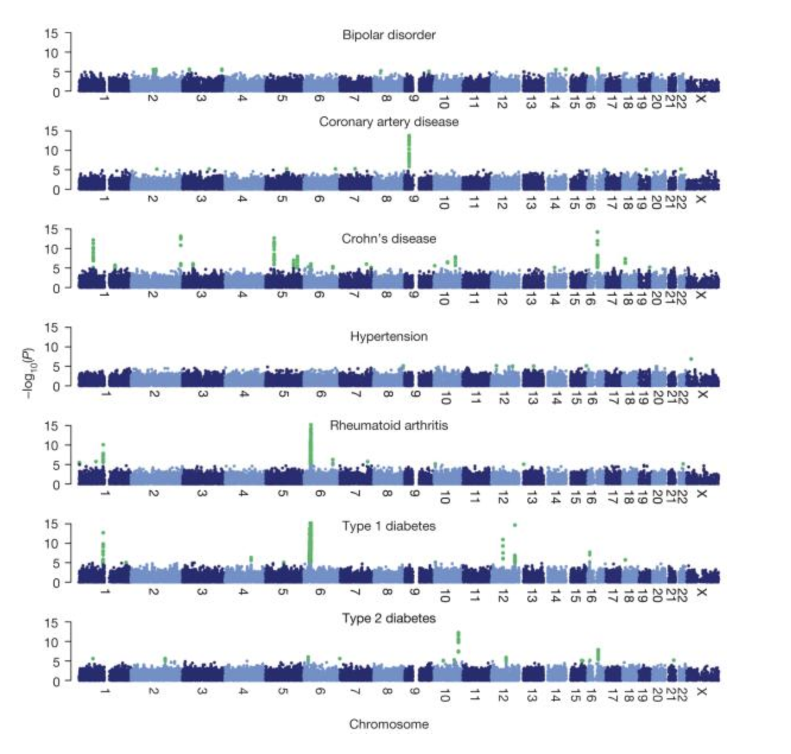
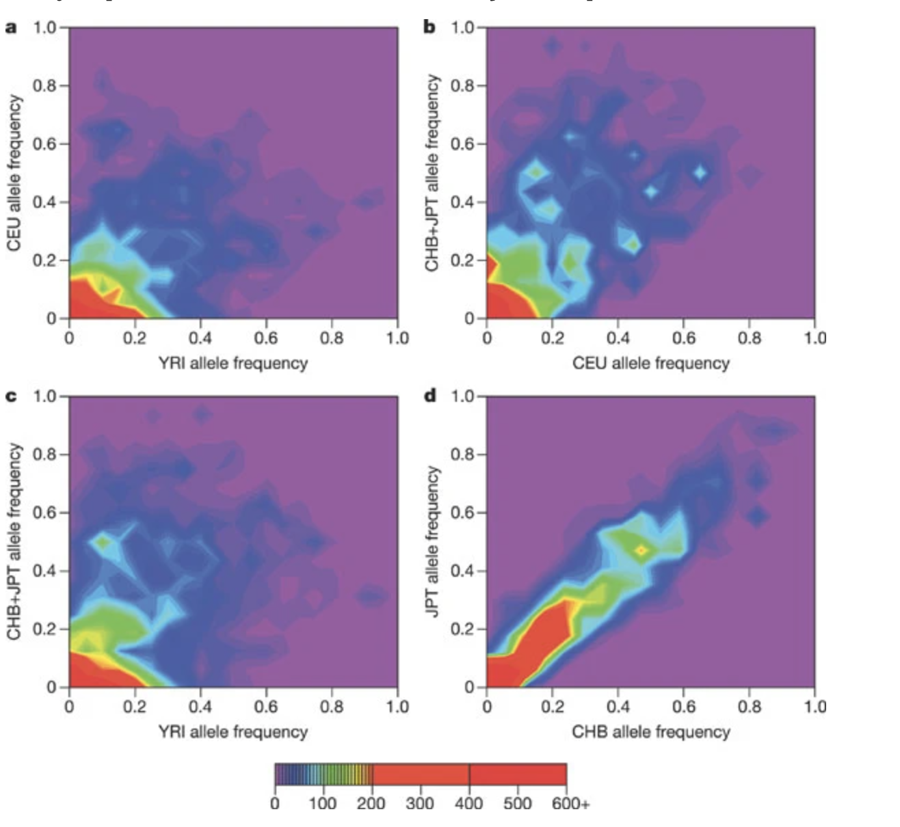

## Projects

The group has been fortunate to be able to contribute to some of the
most high-profile and impactful human genetics projects over the
years. This page details some of that work.

### Genomics England and the 100,000 Genomes Project

[Genomics England (GEL)](https://www.genomicsengland.co.uk/) aims to enable faster, deeper genomic research,
bringing genomic healthcare to all who need it. The GEL flagship project has sequenced [100,000 whole genomes](https://www.genomicsengland.co.uk/about-genomics-england/the-100000-genomes-project/) from NHS patients with rare diseases, and their families, as well as patients with common cancers.

We were awarded a [Wellcome Trust Collaborative Award](https://wellcome.org/grant-funding/people-and-projects/grants-awarded/building-platform-genetic-inference-from-genomics) to produce a set
of derived data sets and analysis tools from the GEL genome sequences
that will have high value for human genetics studies, including
disease genetics studies both on the GEL subjects themselves and third
party studies. This was joint work with Simon Myers and Garrett Hellenthal.

Specific aims include

1. Phase the genome sequences to generate the world’s largest
   haplotype reference panel, empowering very low frequency imputation
   for genome wide association studies.
   
2. Impute the UK Biobank dataset using the GEL reference panel, and
   provide the imputed data back to UK Biobank for use by approved researchers.

3. Use the phased genomes to characterize the fine genetic structure of the English population at an unprecedented level, providing knowledge for population structure matching and adjustment for disease studies.

### UK Biobank

The UK Biobank is one of the largest bio-medical and research
databases in the world, consisting of extensive data collected on
500,00 UK individuals. Our group played a central role in the
production and analysis of the genome-wide genotyping array and
imputed dataset.

This work was published in Nature

[Bycroft et al. (2017) Genome-wide genetic data on ~500,000 UK Biobank participants. Nature 562:203–209l](https://www.nature.com/articles/s41586-018-0579-z)

In addition we worked to analyze the brain MRI phenotypes produced by the project and this was also published in Nature

[Elliott et al. (2018) Genome-wide association studies of brain structure and function in the UK Biobank. Nature 562:210–216](https://www.nature.com/articles/s41586-018-0571-7)

### Haplotype Reference Consortium

The aim of the [Haplotype Reference Consortium (HRC)](http://www.haplotype-reference-consortium.org/home)
 was to create a
large reference panel of human haplotypes by combining together
sequencing data from multiple cohorts. From 2015 this resource has
been used to impute many GWAS samples around the world. This has been
greatly facilitated by imputation servers developed in [Michigan, USA](https://imputationserver.sph.umich.edu/index.html#!) and
[Cambridge, UK](https://imputation.sanger.ac.uk/). I co-led this
 project with Richard Durbin and Goncalo Abecasis.

[The Haplotype Reference Consortium. A reference panel of 64,976 haplotypes for genotype imputation. Nature Genetics 10.1038/ng.3643](https://www.nature.com/articles/ng.3643)

### CONVERGE

The China, Oxford and Virginia Commonwealth University Experimental
Research on Genetic Epidemiology (CONVERGE) project on Major
Depressive Disorder (MDD) sequenced 11,670 female Han Chinese at
low-coverage (1.7X), providing the first large-scale whole genome
sequencing resource representative of the largest ethnic group in the
world. Samples are collected from 58 hospitals from 23 provinces
around China.

Our group contributed to the project by working on genotype imputation
from the low-coverage sequencing data and this resulted in a paper in [Nature](https://www.nature.com/articles/nature14659).

### 1000 Genomes Project

The 1000 Genomes Project was an international consortium that sought
to characterize human genetic variation above 1% frequency using
whole-genome sequencing.

Our group played a central role in many aspects of the analysis. The
contribution was the development of fast and accurate methods for
genotype estimation and phasing from the genotype likelihoods produced from the
whole-genome sequencing. In addition, we developed high specialised
methods that allowed us to infer genotypes and phase CNVs and other
classes of structural variation.

The project lead to a number of high-profile publications

1. [The 1000 Genomes Project Consortium (2015) A global reference for human genetic variation. Nature](https://www.nature.com/articles/nature15393)

2. [O. Delaneau, J. Marchini, The 1000 Genomes Project Consortium (2014) Integrating sequence and array data to create an improved 1000 Genomes Project haplotype reference panel. Nature Communications](https://www.nature.com/articles/ncomms4934)

3. [A. Menelaou and J. Marchini (2013) Genotype calling and phasing using next-generation sequencing reads and a haplotype scaffold. Bioinformatics 29(1):84-91](http://bioinformatics.oxfordjournals.org/cgi/content/abstract/bts632?ijkey=G5i2fOHGfx7kzfc&keytype=ref)

4. [C. Churchhouse and J. Marchini (2013) Multi-way admixture deconvolution using phased or unphased ancestral panels. Genetic Epidemiology 37(1):1-12](http://onlinelibrary.wiley.com/doi/10.1002/gepi.21692/abstract)  

5. [The 1000 Genomes Project Consortium (2012) An integrated map of genetic variation from 1,092 human genomes. Nature 491, 56-65](http://www.nature.com/nature/journal/v491/n7422/full/nature11632.html)  

6. [The 1000 Genomes Consortium (2010) A map of human genome variation from population-scale sequencing. Nature 467, 1061–1073](http://www.1000genomes.org/sites/1000genomes.org/files/docs/nature09534.pdf)  

### Wellcome Trust Case-Control Consortium

The Wellcome Trust Case-Control Consortium (WTCCC) was a UK consortium
of researchers that carried out the first large-scale genome-wide
association studies in the world. The dataset consisted of 4,000 cases
of seven common diseases and 3,000 shared controls. A follow-on project analyzed common CNVs in the same set of samples.

Our group was centrally involved in the analysis and wrote much of the
software used for the genotype calling (CHIAMO), quality control, genotype
imputation (IMPUTE) and association analysis (SNPTEST). This was the first time genotype imputation was used in a genome-wide
association study.

Publications from the project include  

1. [The Wellcome Trust Case Control Consortium (2007) Genome-wide association study of 14,000 cases of seven common diseases and 3,000 shared controls. Nature 447;661-78.](https://www.nature.com/articles/nature05911)

2. [J. Marchini, B. Howie, S. Myers, G. McVean and P. Donnelly (2007) A new multipoint method for genome-wide association studies via imputation of genotypes. Nature Genetics 39 : 906-913](http://www.nature.com/ng/journal/v39/n7/full/ng2088.html)

3. [Genome-wide association study of CNVs in 16,000 cases of eight common diseases and 3,000 shared controls. Wellcome Trust Case-Control Consortium. Nature. 2010;464;713-20.](http://www.nature.com/nature/journal/v464/n7289/full/nature08979.html)

### HapMap Project

The International HapMap Project was an organization that aimed to
develop a haplotype map (HapMap) of the human genome, to describe the
common patterns of human genetic variation. Our group contributed to
the haplotype estimation for the project.

1. [The International HapMap Consortium (2007) A second generation human haplotype map of over 3.1 million SNPs. Nature 449(7164):851](https://www.nature.com/articles/nature06258)

2. [The International HapMap Consortium. A haplotype map of the human genome. Nature 437, 1299-1320. 2005.](https://www.nature.com/articles/nature04226)

3. [J. Marchini, D. Cutler, N. Patterson, M. Stephens, E. Eskin, E. Halperin, S. Lin, Z.S. Qin, H.M. Munro, G.R. Abecasis, P. Donnelly, and International HapMap Consortium (2006) A Comparison of Phasing Algorithms for Trios and Unrelated Individuals. American Journal of Human Genetics, 78 437-450](https://www.cell.com/ajhg/fulltext/S0002-9297(07)62383-0)

4. [The International HapMap Consortium (2003). The international HapMap project. Nature 426 789-796](https://www.nature.com/articles/nature02168)
