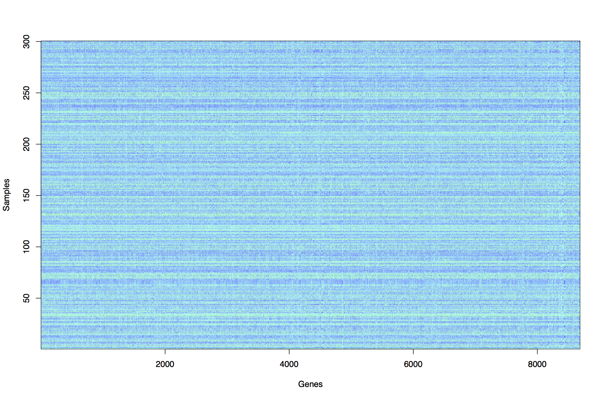
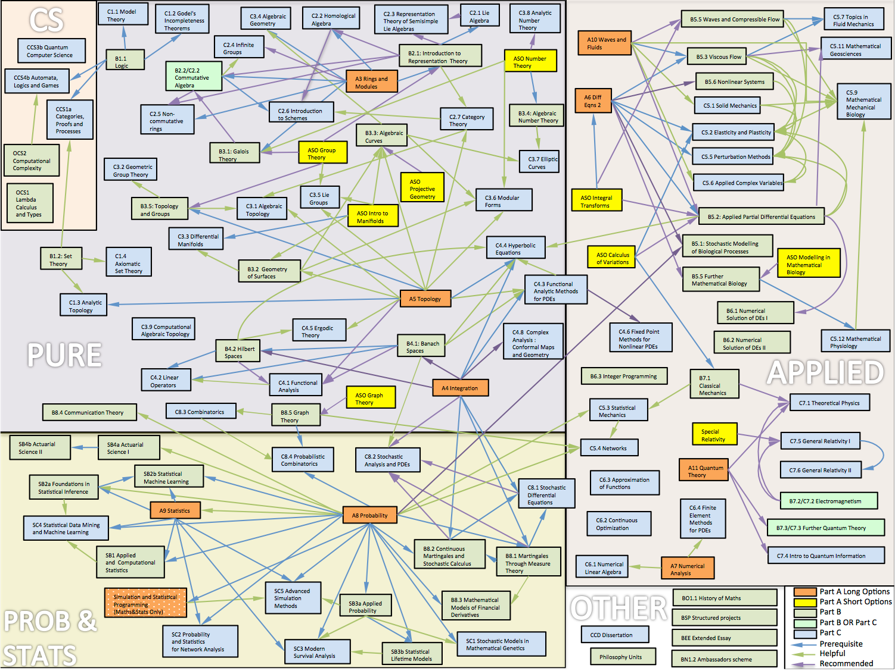

## Teaching

This page contains some of the teaching resources I developed while in Oxford.

### Prelims Statistics (Unsupervised Learning) 
I developed this course to double the amount of Statistics taught to
1st year Maths/Stats students at Oxford (2016-2017)

The aim of the course is to introduce students to the theory and practice of unsupervised learning.

Unsupervised learning can be described as finding structure in datasets, and has applications in many areas such as finance, retail, medical imaging, sports performance analysis, genetics, medicine, studies of the environment and social networks.

Unsupervised learning methods are important parts of Computational Statistics, Machine Learning, Artificial Intelligence and Big Data.

*Motivating example*

Raw dataset : 300 x 8686 matrix of gene expression measurements from Pollen et al (2014) Nature Biotechnology 32, 1053-1058 Viewing the raw data it is very difficult to see any clear structure or similarity between the samples.

3D Projection and clustering : The method of Principal Components Analysis (PCA) has been applied to the dataset in order to uncover structure. A clustering method (k-means) has then been applied to group observations in distinct groupings or clusters. Students will learn the theory and practical skills to reproduce this analysis.

#### Lecture slides and course notes 
Students should take notes in each lecture, but I will use slides as visual aids to illustrate various concepts and results. slides.pdf

Here is a link to the course notes [course_notes.pdf](https://www.dropbox.com/s/6012dvuml99q7ga/course_notes.pdf?dl=0)

#### Exercise sheets
There will be 3 exercise sheets for this part of the course.

|Sheet | pdf|
| | |
|1 |sheet6.pdf|
|2 |sheet7.pdf|
|3 |sheet8.pdf|

#### R/Matlab exercises 
Each sheet will contain a mix of written questions and Optional questions to be done either using R or Matlab.

It is up to each college tutor to decide whether students should attempt these questions, but it is strongly recommended, as these questions will help with understanding of the theory.

Modern statistics is pervasive in the era of “Big Data”. The majority of Maths graduates will go on to careers that involve some use of data, so a firm practical grounding in statistical analysis is highly valuable. An aim of this course is to get students started on being able to independently carry out statistical data analysis.

As many student will not have worked with R, here is a short tutorial document that will introduce R, show students how to install R and get started with some basics.

[R_intro.pdf](https://www.dropbox.com/s/z5yniv7o5w0erom/R_Intro.pdf?dl=0)

##### Book
The following book gives a good overview of the methods covered in this course

This book is freely available online here [http://www-bcf.usc.edu/~gareth/ISL/](http://www-bcf.usc.edu/~gareth/ISL/)

G. James, D. Witten, T. Hastie, R. Tibshirani An Introduction to Statistical Learning (with Applications in R) (Springer 2013)

Chapter 10 covers unsupervised learning.

###  Part B Foundations of Statistical Inference (BS2a) 
This was an existing course for 3rd year Maths/Stats students on statistical theory. I amended the syllabus to include material on the EM algorithm and Variational Bayes and approximations to marginal likelihood : Laplace approximation and BIC. (2012-2013)

**Course aims** Understanding how data can be interpreted in the context of a statistical model. Working knowledge and understanding of key-elements of model-based statistical inference, including awareness of similarities, relationships and differences between Bayesian and frequentist approaches.

**Synopsis**

*Exponential families* Curved and linear exponential families; canonical parametrization; likelihood equations. Sufficiency: Factorization theorem; sufficiency in exponential families.

*Frequentist estimation* unbiasedness; method of moments; the Cramer-Rao information inequality; Rao-Blackwell theorem, Lehmann-Scheffe Theorem and Rao-Blackwellization.
Statement of complete sufficiency for Exponential families.

*The Bayesian paradigm* likelihood principal; subjective probability; prior to posterior analysis; asymptotic normality; conjugacy; examples from exponential families. Choice of prior distribution: proper and improper priors; Jeffreys and maximum entropy priors. Hierarchical Bayes models.

*Computational techniques* Markov chain Monte Carlo methods; The Metropolis-
Hastings algorithm. Gibbs Sampling. Variational Bayesian methods. The EM
algorithm. Approximations to marginal likelihood : Laplace approximation and
BIC.

*Decision theory* risk function; Minimax rules, Bayes rules. Point estimators and admissability of Bayes rules. The James-Stein estimator, shrinkage estimators and Empirical Bayes. Hypothesis testing as decision problem.

#### Lecture slides
PDF of all 16 lectures in 4up format : [bs2a_4up.pdf](https://www.dropbox.com/s/ll4jtgzfmgfc773/bs2a_4up.pdf?dl=0)

#### Exercise sheets

| Class |Sheet|
| | |
|Week 3|[ex1.pdf](https://www.dropbox.com/s/ef3b17s482kqp00/ex1.pdf?dl=0)|
|Week 4|[ex2.pdf](https://www.dropbox.com/s/2pp4oezc6pl58if/ex2.pdf?dl=0)|
|Week 5|[ex3.pdf](https://www.dropbox.com/s/lt9mympft6206to/ex3.pdf?dl=0)|
|Week 6|[ex4.pdf](https://www.dropbox.com/s/pmda9uof8pe7nfa/ex4.pdf?dl=0)|
|Week 7|[ex5.pdf](https://www.dropbox.com/s/5q1gi5nph99ljy1/ex5.pdf?dl=0)|
|Week 8|[ex6.pdf](https://www.dropbox.com/s/g4xbgdku5j52szj/ex6.pdf?dl=0)|

##### Reading
P. H. Garthwaite, I. T. Jolliffe and Byron Jones, Statistical Inference, OUP  
G.A.Young and R.L. Smith,  Essentials of Statistical Inference, CUP.  
T. Leonard and J.S.J. Hsu, Bayesian Methods, CUP.

*Further reading*

D. R. Cox, Principles of Statistical Inference, CUP  
H. Liero and S Zwanzig, Introduction to the Theory of Statistical Inference, CRC Press  
D. Barber, Bayes Reasoning and Machine Learning, CUP  

### Part A Statistical Programming 
I developed this course to introduce statistical computing (using R)
to undergraduate Maths&Stats students in the their 2nd year
(previously it took until the 3rd year before they had any exposure to
statistical computing. (2010-2011)

The aim of the course is to introduce students to how to carry out statistical analysis using a computer and the theory of statistical programming and its related techniques. The course will be based on the R programming language which is now widely used in all branches of applied statistics.

#### Lectures and practical sessions
There will be 6 classes, made up of a lecture followed by a computer
practical session (using R): all lectures and all practical sessions are an essential part of the course. If practical sheets are not finished in the practical sessions then they should be completed outside the practical.

| Topic | Lectures | Practical|
| | | |
|Introduction | week1.pdf | week1prac.pdf |
|Working with data |week2.pdf |week2prac.pdf|
| Programming I |week3.pdf |week3prac.pdf|
|Programming II |week4.pdf |week4prac.pdf|
|Solving Equations and Optimization |week5.pdf |week5prac.pdf|
|Simulation |week6.pdf |week6prac.pdf|

**Datasets**

The following datasets are used in the practical sessions

hellung.txt  
cystfibr.txt  
juul.txt  
AIDS.txt  
speed.txt  

#### Exercise sheets 
As the exam for this course is a written exam it is important to practice questions without using a computer.

For this reason there will be two written exercise sheets with a class for each one. The details are below.

|Written exercise sheet|	Deadline	|Class times|
|- | - | - |
|Week 7 : Sheet1.pdf	|Tues 8 March, by 5pm, SPR1	|Thur 10 March 2-3pm, 3-4pm|
|Week 8 : Sheet2.pdf	|Tues 10 May, by 5pm, SPR1	|Thur 12 May 2-3pm, 3-4pm|

**Programming with R**
The course will teach you how to write programs using the statistical computing environment called R.

If you have your own computer you are strongly encouraged to download and install the software (it’s free) so that you can work on the problem sheets and complete any of the practicals as required.

The software can be downloaded from this website [http://www.r-project.org/](http://www.r-project.org/)

**Books**
In addition to the extensive documentation and help system that is included in R there are two main books that we recommend.

`Introductory Statistics with R’ by Peter Dalgaard, ISBN 0-387-95475-9

– a very good introduction to R that includes many biostatistical examples and covers most of the basic statistics covered in this course.

`Modern Applied Statistics with S’ by Bill Venables and Brian Ripley, ISBN 0-387-95457-0

– a comprehensive text that details the S-PLUS and R implementation of many statistical methods using real datasets.

###  Introduction to Probability and Statistics 
this course was taken by 1st year students in Psychology and Human
Sciences 
This lecture course was taught for 1st year Psychology and Human
Sciences students (2002-2008)

####Lecture Slides, Notes and Exercise Sheets

| Lecture | Topic | Notes | Slides | Exercises |
|---|-----|----|----|-----|
| Lecture 1 | Plotting Data + Summaries | [L1.notes.pdf](https://www.dropbox.com/s/p71nl8vx9oo1tj6/L1.notes.pdf?dl=0) | [L1.slides.pdf](https://www.dropbox.com/s/mj8q48ckru185gl/L1.slides.pdf?dl=0)| [L1.exercise.pdf](https://www.dropbox.com/s/zvg7sutaufufhy2/L1.exercise.pdf?dl=0)|
| Lectures 2+3 | Probability | [L2.notes.pdf](https://www.dropbox.com/s/0uxy5m963u3hjmb/L2.notes.pdf?dl=0) | [L2.slides.pdf](https://www.dropbox.com/s/mk3awzhv2ckxgx0/L2.slides.pdf?dl=0) | [L2.exercise.pdf](https://www.dropbox.com/s/25rpbgkbtvie6eb/L2.exercise.pdf?dl=0)|
| Lecture 4 | Binomial Distribution | [L4.notes.pdf](https://www.dropbox.com/s/alt5885kv0y3twt/L4.notes.pdf?dl=0) | [L4.slides.pdf](https://www.dropbox.com/s/bsbzozyrhb93n5o/L4.slides.pdf?dl=0) | [L4.exercise.pdf](https://www.dropbox.com/s/lodfvwirwkp3702/L4.exercise.pdf?dl=0)|
| Lecture 5 | Poisson Distribution | [L5.notes.pdf](https://www.dropbox.com/s/n630wblgyxwxzzg/L5.notes.pdf?dl=0) |  [L5.slides.pdf](https://www.dropbox.com/s/3z82saep781gxei/L5.slides.pdf?dl=0) | [L5.exercise.pdf](https://www.dropbox.com/s/3z82saep781gxei/L5.slides.pdf?dl=0)|
| Lecture 6 | Normal Distribution | [L6.notes.pdf](https://www.dropbox.com/s/cdwhwv0ol2gscp0/L6.notes.pdf?dl=0) | [L6.slides.pdf](https://www.dropbox.com/s/h34veaxktkwevc9/L6.slides.pdf?dl=0) | [L6.exercise.pdf](https://www.dropbox.com/s/h34veaxktkwevc9/L6.slides.pdf?dl=0)|
| Lecture 7 |Hypothesis Tests | [L7.notes.pdf](https://www.dropbox.com/s/tth9xgtyth9g4sl/L7.notes.pdf?dl=0) | [L7.slides.pdf](https://www.dropbox.com/s/sh2884fatck1dvx/L7.slides.pdf?dl=0)| [L7.exercise.pdf](https://www.dropbox.com/s/ykqq92re5ktausx/L7.exercise.pdf?dl=0)|
| Lecture 8 | Chi-squared Tests| [L8.notes.pdf](https://www.dropbox.com/s/zsvbp5ud0190lf3/L8.notes.pdf?dl=0) | [L8.slides.pdf](https://www.dropbox.com/s/cv4papm4k9ssflk/L8.slides.pdf?dl=0) |[L8.exercise.pdf](https://www.dropbox.com/s/cv4papm4k9ssflk/L8.slides.pdf?dl=0)|

**Recommended Books**
The two books that have been recommended in past years for Psychology and Human Sciences respectively are

HOWELL, David C. Statistical Methods for Psychology Fiffth Edition 802pp Hardback (ISBN 053437770) £26.99

COHEN, Lousi and HOLLIDAY, Michael Practical Statistics for Students 352pp Paperback (ISBN 1853963291) £17.99

###  Graduate lectures

[Variational Bayes (2011)](https://www.dropbox.com/s/529r2wi0qhcc12w/VB.pdf?dl=0)

[Missing Data (2016)](https://www.dropbox.com/s/11ulk41uaootk1v/missing_data.pdf?dl=0) + [Practical](https://www.dropbox.com/s/xz2s9k2jmzmw3ng/practical.pdf?dl=0)

### Mathematics Options Map

This ‘map’ was constructed from the course handbooks for the 2016-17 year on the Oxford Maths website
I used to recommend that students use this as a guide when choosing
courses, and to understand where those choices might lead, due to
dependencies between courses. Students found it very helpful. The
course handbooks give more detail on each course, but the overall
structure of the degree is easier to see via this map. It is likely
now out of date, although it will still give a good idea of the main
structure of the courses on offer

### WT Advanced Course

For 10 years I co-taught a
[Wellcome Trust Advanced Course on genetic association studies](https://coursesandconferences.wellcomeconnectingscience.org/event/genetic-analysis-of-population-based-association-studies-virtual-20210920/)
with Heather Cordell and Andrew Morris.
